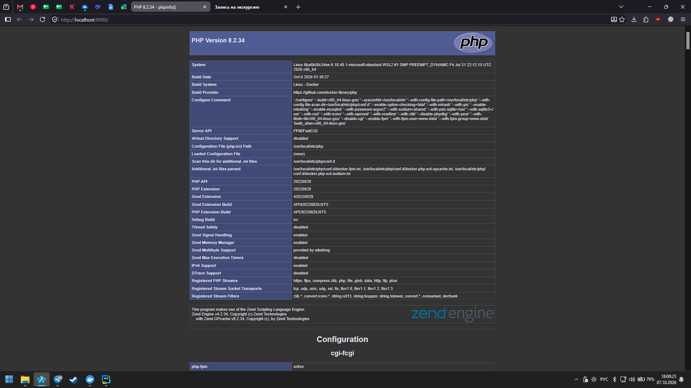
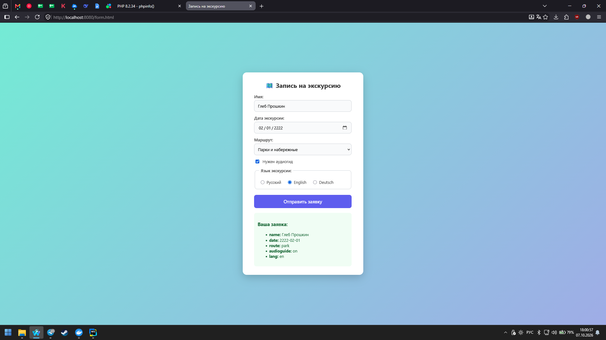
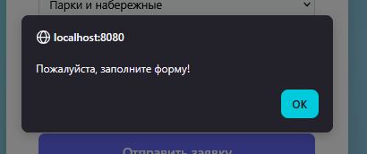
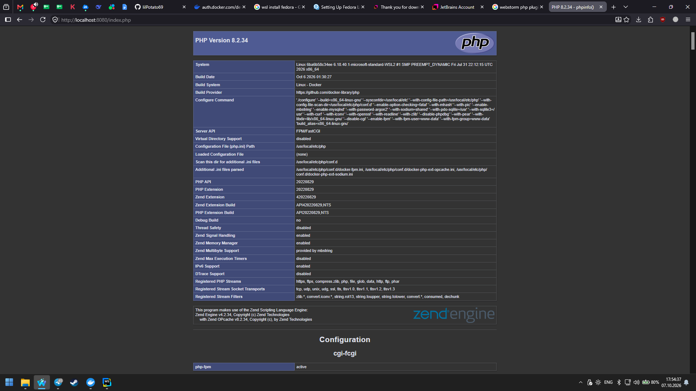

# 🧑‍💻 Лабораторная работа №2

**Тема:** Настройка Nginx + PHP-FPM. Основы HTML-форм и обработка на JavaScript.
**Вариант:** 8. Запись на экскурсию.
**Статус:** Выполнено основное задание + все штрафные задания.

---

## 🎯 Цель работы

1. Научиться конфигурировать веб-сервер Nginx для работы с PHP через PHP-FPM.
2. Освоить базовые принципы PHP (на примере `phpinfo()`).
3. Повторить основы HTML: работа с формами, различными типами полей ввода.
4. Освоить базовую обработку форм с помощью JavaScript без перезагрузки страницы.

---

## 🛠 Стек технологий

* **Docker / Docker Compose** — контейнеризация
* **Nginx** (1.27-alpine) — веб-сервер
* **PHP-FPM** (8.2-fpm) — обработчик PHP
* **HTML5 / CSS3 / JavaScript (Vanilla)** — фронтенд

---


---
## 📁 Структура проекта

```text
lab2/
 ├── docker-compose.yml       # Конфигурация контейнеров
 ├── nginx/
 │    └── default.conf        # Конфигурация Nginx для PHP
 └── www/
      ├── index.php           # Проверка работы PHP (phpinfo)
      ├── form.html           # HTML-форма записи на экскурсию
      ├── style.css           # Стили и анимации
      └── script.js           # Обработка формы и таймер бездействия


