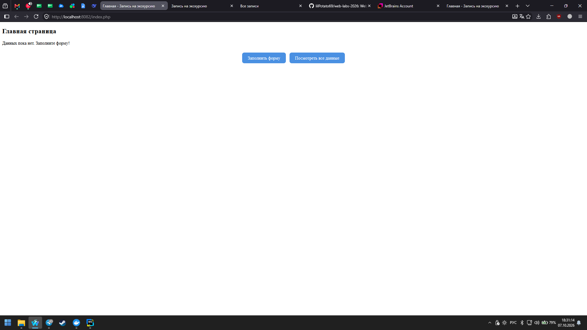
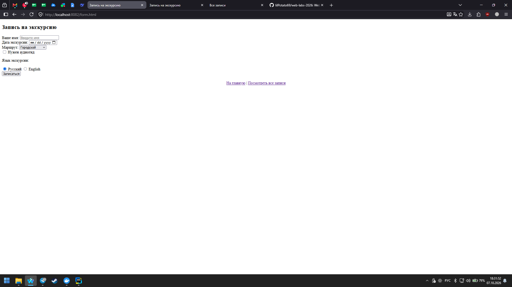
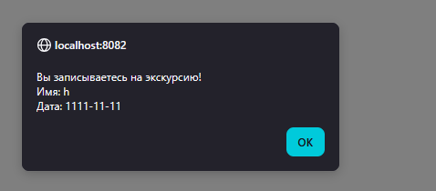
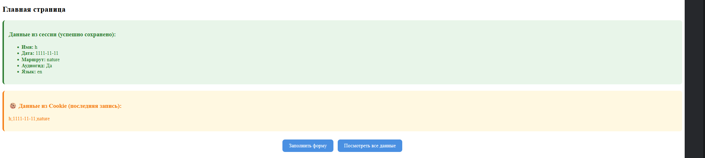
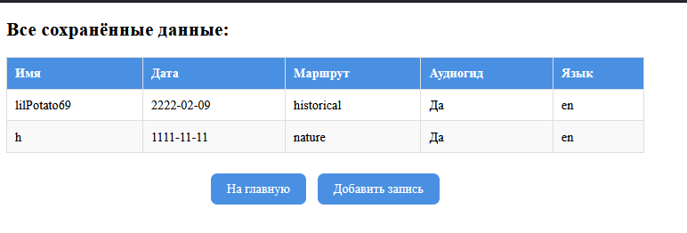
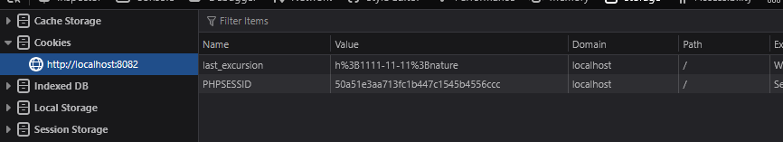

# 🧑‍💻 Лабораторная работа №3

**Тема:** Обработка форм на стороне сервера (PHP), сессии, файлы, валидация.
**Вариант:** 8. Запись на экскурсию.
**Статус:** Выполнено основное задание + все штрафные задания.

---

## 🎯 Цель работы

1. Научиться обрабатывать данные формы на стороне сервера с помощью PHP.
2. Сохранять данные формы в **сессии**.
3. Сохранять данные в **файл** и выводить их обратно на странице.
4. Научиться выводить все сохранённые данные на отдельной странице.
5. Научиться изменять существующую форму, чтобы отключить JS-обработку (кроме alert) и использовать PHP.

---

## 🛠 Стек технологий

* **Docker / Docker Compose**
* **Nginx** (1.27-alpine)
* **PHP-FPM** (8.2-fpm)
* **HTML5 / CSS3 / JavaScript (Vanilla)**

---






---
## 📁 Структура проекта

```text
lab3/
 ├── docker-compose.yml
 ├── nginx/
 │    └── default.conf
 └── www/
      ├── index.php       # Главная страница (вывод сессий, ошибок, кук)
      ├── form.html       # HTML-форма
      ├── process.php     # Обработчик формы (валидация, сессии, файл, куки)
      ├── view.php        # Просмотр всех записей из data.txt
      ├── style.css       # Стили
      ├── script.js       # Только alert перед отправкой
      └── data.txt        # Файл с сохранёнными данными