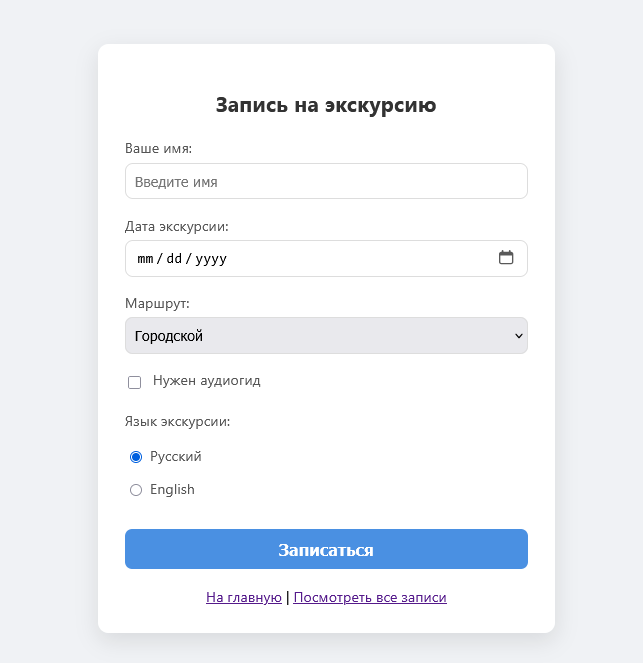
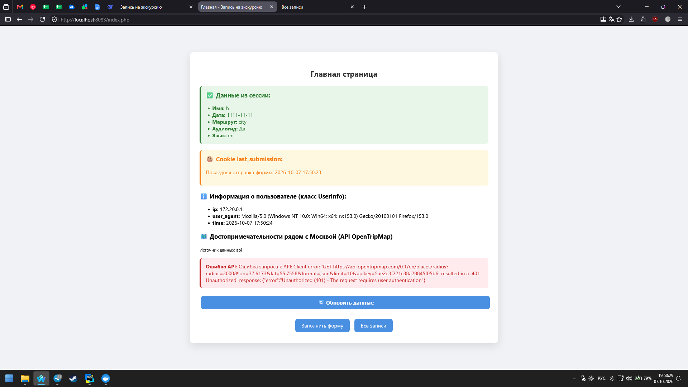
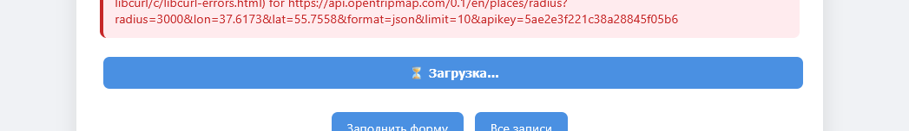
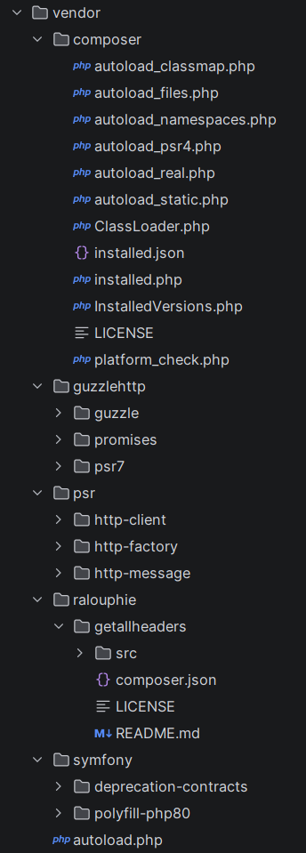

# 🧑‍💻 Лабораторная работа №4

**Тема:** Composer, классы и работа с публичным API.
**Вариант:** 8. Запись на экскурсию → API OpenTripMap (достопримечательности).
**Статус:** Выполнено основное задание + все штрафные задания.

---

## 🎯 Цель работы

1. Освоить Composer и структуру `vendor`.
2. Научиться работать с классами и внешними библиотеками.
3. Научиться получать и отображать данные из публичного API.
4. Отработать работу с куками и пользовательской информацией.

---

## 🛠 Стек технологий

* **Docker / Docker Compose**
* **Nginx** (1.27-alpine)
* **PHP-FPM** (8.2-fpm)
* **Composer** + **GuzzleHttp** (для HTTP-запросов к API)
* **OpenTripMap API** — публичный API без регистрации

---




---
## 📁 Структура проекта

```text
lab4/
 ├── Dockerfile               # PHP-FPM с Composer и расширением curl
 ├── docker-compose.yml
 ├── .gitignore               # vendor/ и api_cache.json не коммитятся
 ├── nginx/
 │    └── default.conf
 └── www/
      ├── composer.json
      ├── composer.lock
      ├── vendor/             # автозагрузка Composer (не в Git)
      ├── ApiClient.php       # класс-обёртка над Guzzle
      ├── UserInfo.php        # класс со статическим методом getInfo()
      ├── api_refresh.php     # AJAX-эндпоинт для кнопки "Обновить"
      ├── index.php           # главная страница
      ├── form.html           # форма (из ЛР-3)
      ├── process.php         # обработчик формы + API + кеш + кука
      ├── view.php            # просмотр всех записей (из ЛР-3)
      ├── script.js           # alert + fetch "Обновить"
      ├── style.css           # стили
      ├── data.txt            # файл с записями
      └── api_cache.json      # кеш ответа API (5 минут, не в Git)