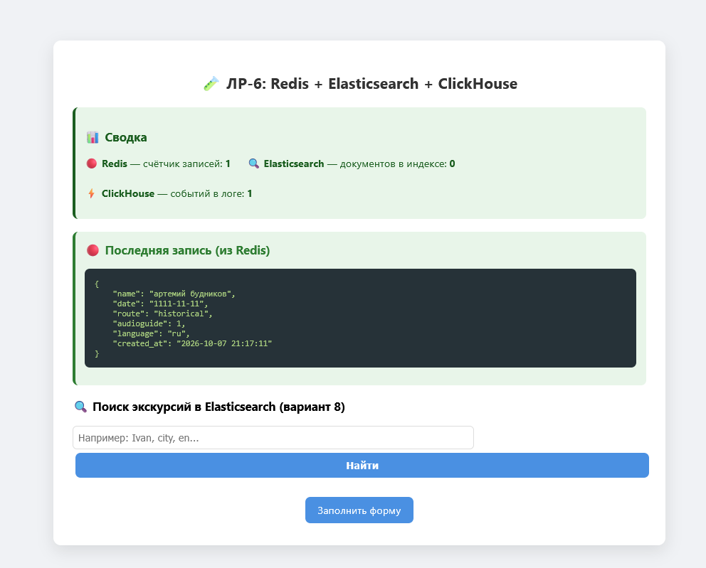
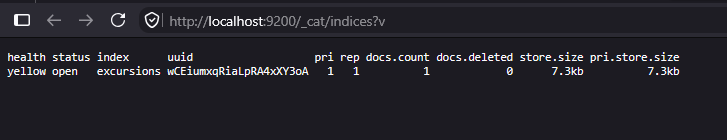
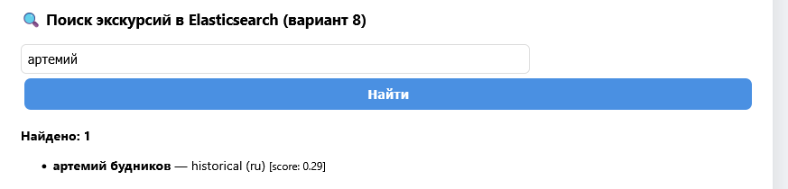
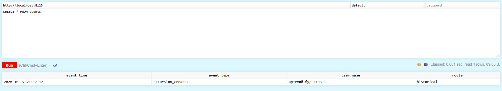
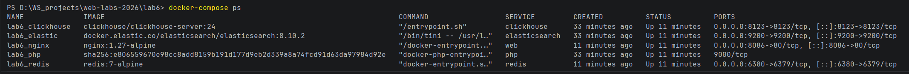

# 🧑‍💻 Лабораторная работа №6

**Тема:** Изучение нереляционных баз данных (Redis, Elasticsearch, ClickHouse) и взаимодействие с ними через API с помощью GuzzleClient.
**Вариант:** 8. Запись на экскурсию → база **Elasticsearch** (новости/поиск по записям).
**Статус:** Выполнено основное задание + все штрафные задания.

---

## 🎯 Цель работы

1. Закрепить навыки работы с HTTP-запросами и API-интерфейсами.
2. Познакомиться с современными нереляционными СУБД: Redis, Elasticsearch, ClickHouse.
3. Освоить взаимодействие с ними через GuzzleClient и официальные клиенты.
4. Реализовать обмен данными между тремя NoSQL-базами и PHP-приложением.

---

## 🛠 Стек технологий

* **Docker / Docker Compose**
* **Nginx** (1.27-alpine)
* **PHP-FPM** (8.2-fpm) + **Composer**
* **GuzzleHttp** — HTTP-клиент для Elasticsearch и ClickHouse
* **Predis** — клиент для Redis
* **Redis 7** — кэш и счётчики
* **Elasticsearch 8.10** — полнотекстовый поиск (основная БД варианта 8)
* **ClickHouse 24** — лог событий

---





---
## 📁 Структура проекта

```text
lab6/
 ├── Dockerfile
 ├── docker-compose.yml
 ├── .gitignore
 ├── nginx/
 │    └── default.conf
 └── www/
      ├── composer.json
      ├── composer.lock
      ├── vendor/                       # автозагрузка Composer (не в Git)
      ├── src/
      │    ├── Helpers/
      │    │    └── ClientFactory.php   # фабрика Guzzle-клиентов
      │    ├── RedisExample.php         # класс для работы с Redis
      │    ├── ElasticExample.php       # класс для работы с Elasticsearch
      │    └── ClickhouseExample.php    # класс для работы с ClickHouse
      ├── index.php                     # главная: сводка + поиск + JSON из Redis
      ├── form.html                     # форма записи на экскурсию
      ├── process.php                   # обработчик: Redis + ES + ClickHouse
      ├── style.css
      └── script.js