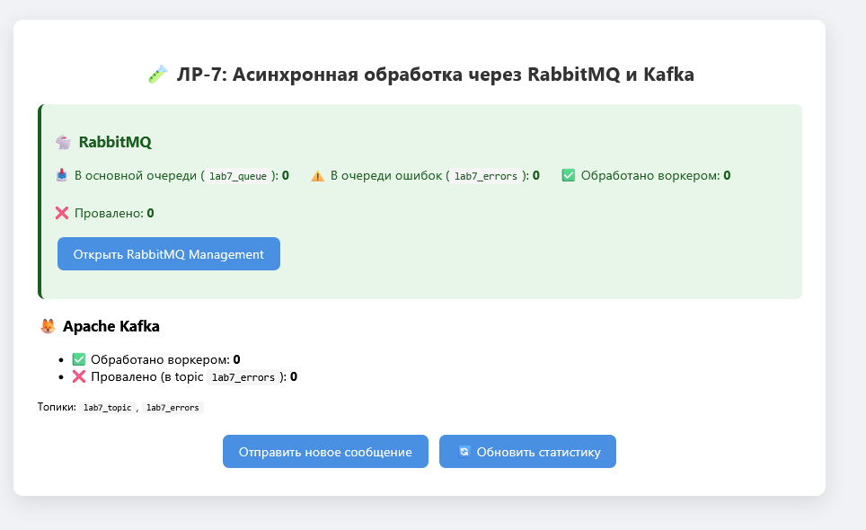
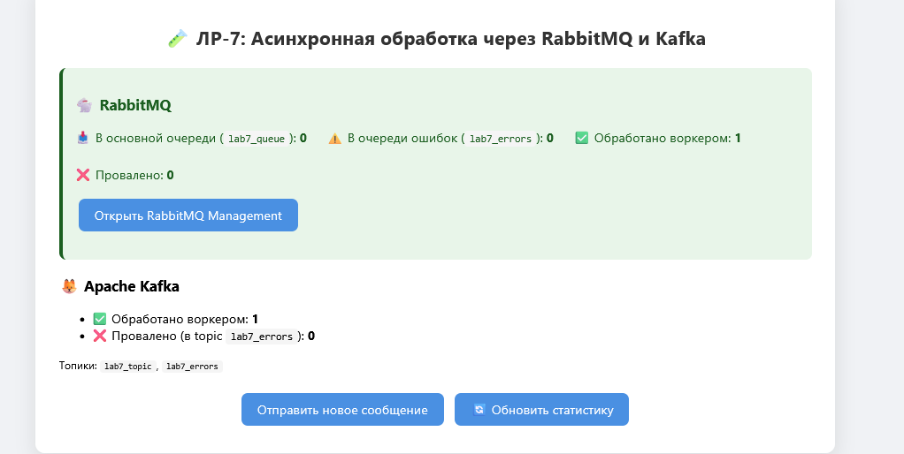
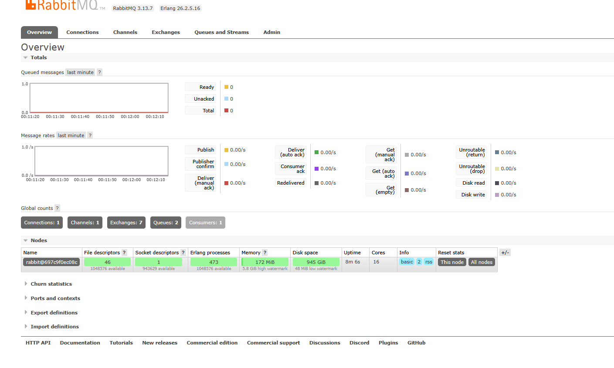
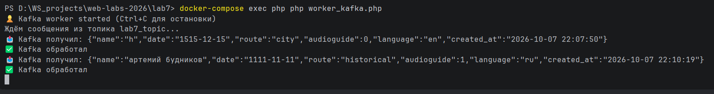
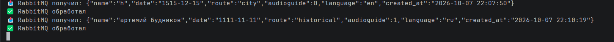

# 🧑‍💻 Лабораторная работа №7

**Тема:** Асинхронная обработка данных через очереди сообщений (RabbitMQ / Kafka).
**Вариант:** 8 (чётный → RabbitMQ, но выполнено штрафное задание — обе системы).
**Статус:** Выполнено основное задание + все штрафные задания.

---

## 🎯 Цель работы

1. Научиться работать с очередями сообщений.
2. Реализовать асинхронную обработку данных в PHP.
3. Познакомиться с брокерами сообщений RabbitMQ и Apache Kafka.
4. Создать producers (отправители) и consumers (обработчики) задач.

---

## 🛠 Стек технологий

* **Docker / Docker Compose**
* **Nginx** (1.27-alpine)
* **PHP-FPM** (8.2-fpm) + Composer
* **php-amqplib** — клиент RabbitMQ
* **ext-rdkafka** — нативное расширение PHP для Kafka
* **Guzzle** — HTTP-клиент (для Management API RabbitMQ)
* **RabbitMQ 3** + Management UI
* **Apache Kafka 3.7** (KRaft-режим, без Zookeeper)

---





---

## 📁 Структура проекта

```text
lab7/
 ├── Dockerfile
 ├── docker-compose.yml
 ├── .gitignore
 ├── nginx/
 │    └── default.conf
 └── www/
      ├── composer.json
      ├── composer.lock
      ├── vendor/
      ├── QueueManager.php      # RabbitMQ producer + consumer + stats
      ├── KafkaManager.php      # Kafka producer + consumer (rdkafka)
      ├── process.php           # публикует в обе очереди
      ├── worker_rabbit.php     # consumer RabbitMQ
      ├── worker_kafka.php      # consumer Kafka
      ├── index.php             # статистика по обеим системам
      ├── form.html
      ├── style.css
      └── script.js