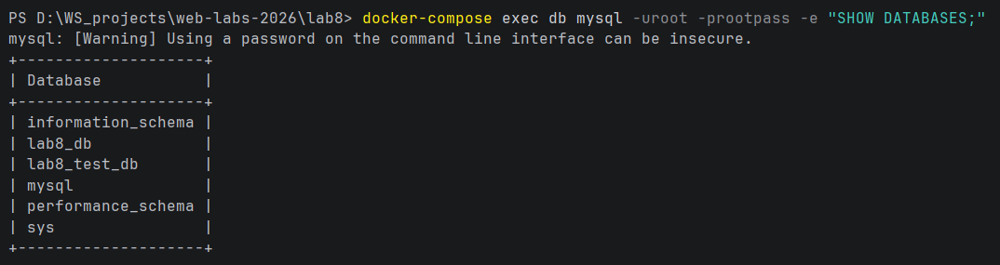
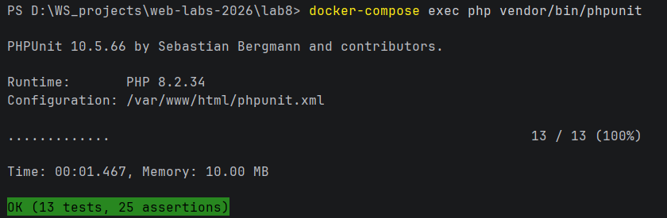
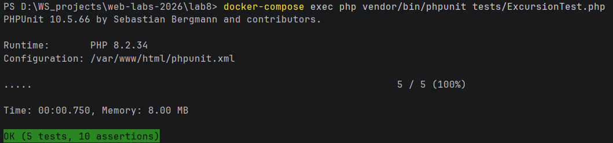
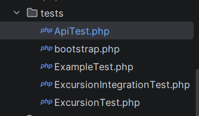
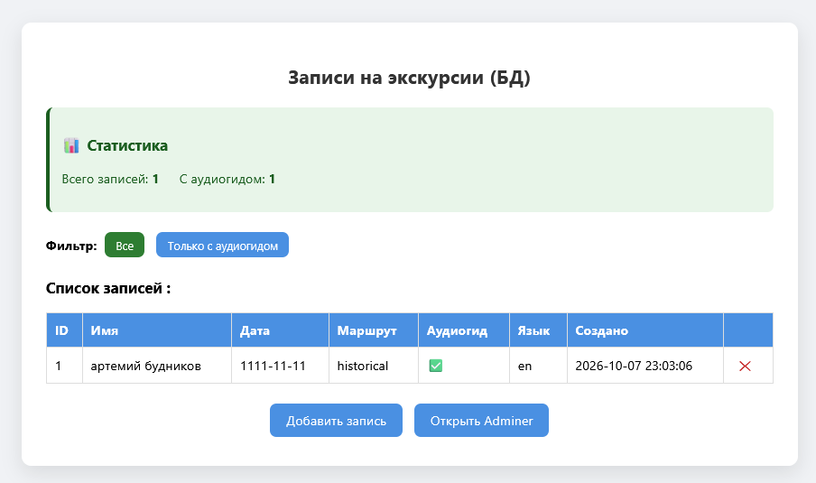
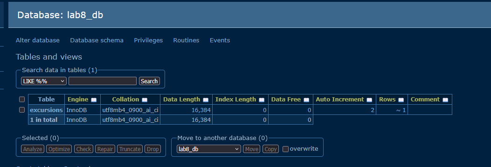

# 🧑‍💻 Лабораторная работа №8

**Тема:** Тестирование PHP-приложения с использованием PHPUnit и Guzzle.
**Вариант:** 8. Запись на экскурсию.
**Статус:** Выполнено основное задание + все штрафные задания.

---

## 🎯 Цель работы

1. Научиться устанавливать и использовать PHPUnit.
2. Писать unit-тесты для классов.
3. Использовать mock-объекты.
4. Тестировать HTTP-запросы через Guzzle.
5. Работать с переменными окружения (.env).
6. Изолировать тестовую среду.

---

## 🛠 Стек технологий

* **Docker / Docker Compose**
* **Nginx** (1.27-alpine)
* **PHP-FPM** (8.2-fpm) + **Composer**
* **PHPUnit 10.5**
* **Guzzle 7** — HTTP-клиент
* **vlucas/phpdotenv** — чтение `.env.test`
* **MySQL 8** — отдельная БД `lab8_test_db` для тестов
* **Adminer** — визуальный просмотр БД

---








---

## 📁 Структура проекта

```text
lab8/
 ├── Dockerfile
 ├── docker-compose.yml
 ├── nginx/
 │    └── default.conf
 ├── init/
 │    └── init.sql                   # создаёт тестовую БД
 └── www/
      ├── composer.json
      ├── phpunit.xml
      ├── .env.test                  # переменные окружения для тестов
      ├── .gitignore
      ├── db.php
      ├── Excursion.php
      ├── index.php
      ├── form.html
      ├── process.php
      ├── style.css
      └── tests/
           ├── bootstrap.php
           ├── ExampleTest.php
           ├── ExcursionTest.php
           ├── ApiTest.php
           └── ExcursionIntegrationTest.php