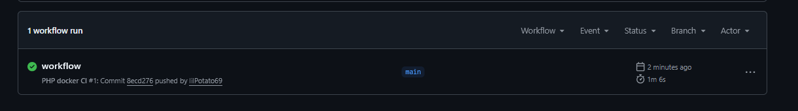
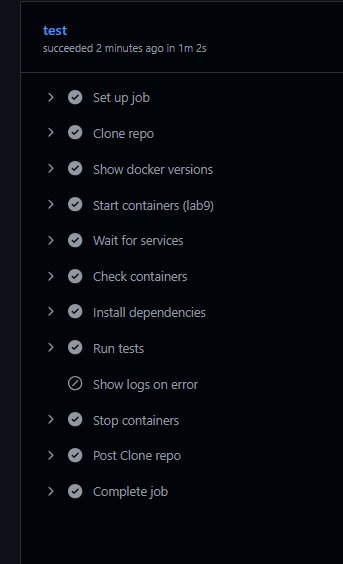
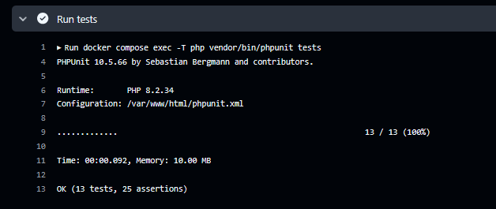
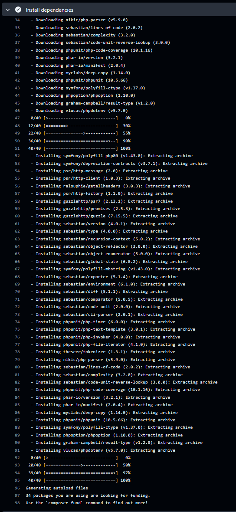
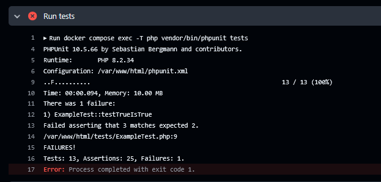
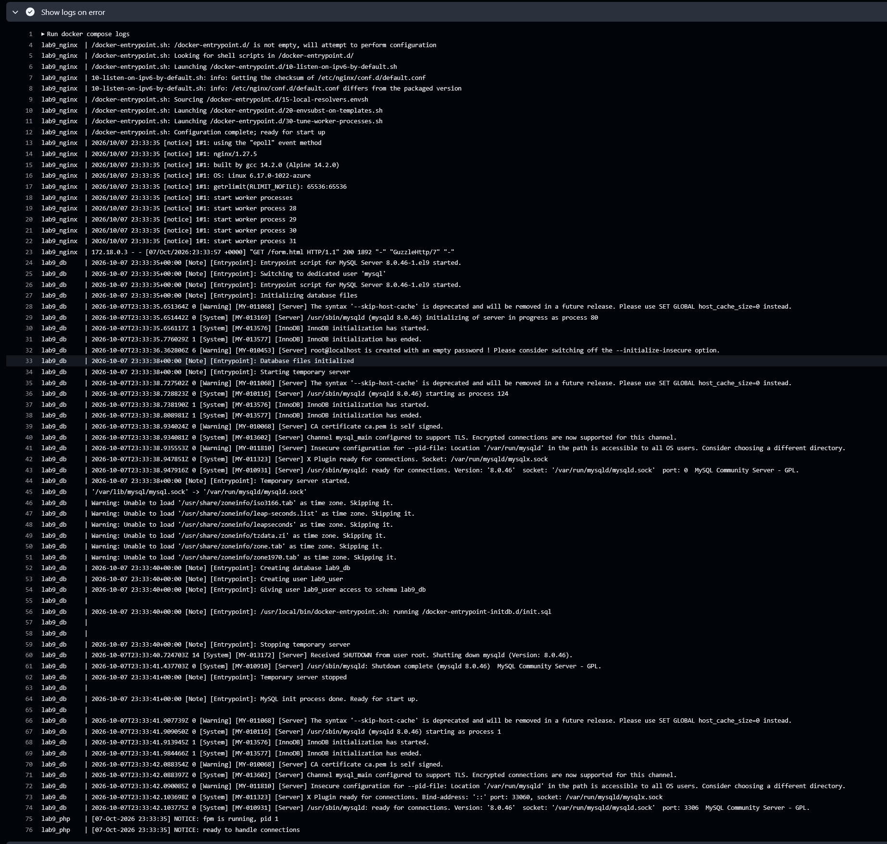
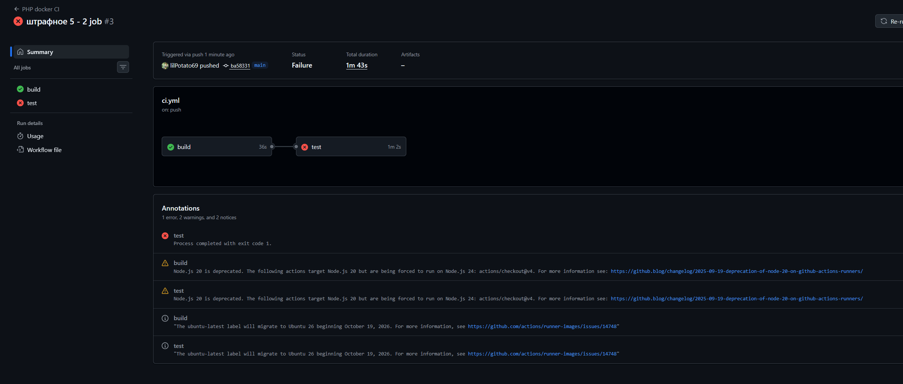

# 🧑‍💻 Лабораторная работа №9

**Тема:** CI/CD для PHP-приложения с использованием GitHub Actions и Docker.
**Статус:** Выполнено основное задание + все штрафные задания.

---

## 🎯 Цель работы

1. Настроить CI/CD pipeline.
2. Использовать GitHub Actions.
3. Запускать Docker-контейнеры в CI.
4. Автоматически запускать тесты PHPUnit.
5. Выявлять ошибки через CI.

---

## 🛠 Стек технологий

* **GitHub Actions** — CI/CD
* **Docker / Docker Compose**
* **Nginx / PHP-FPM / MySQL**
* **PHPUnit 10.5**
* **Composer**

---







---

## 📁 Структура проекта

```text
web-labs-2026/
 ├── .github/
 │    └── workflows/
 │         └── ci.yml              # CI/CD workflow (в корне!)
 ├── lab1/
 ├── ...
 ├── lab8/
 └── lab9/
      ├── Dockerfile
      ├── docker-compose.yml
      ├── nginx/default.conf
      ├── init/init.sql
      └── www/
           ├── composer.json
           ├── phpunit.xml
           ├── .env.test
           ├── Excursion.php
           ├── db.php
           ├── index.php
           ├── form.html
           ├── process.php
           ├── style.css
           └── tests/
                ├── bootstrap.php
                ├── ExampleTest.php
                └── ExcursionTest.php